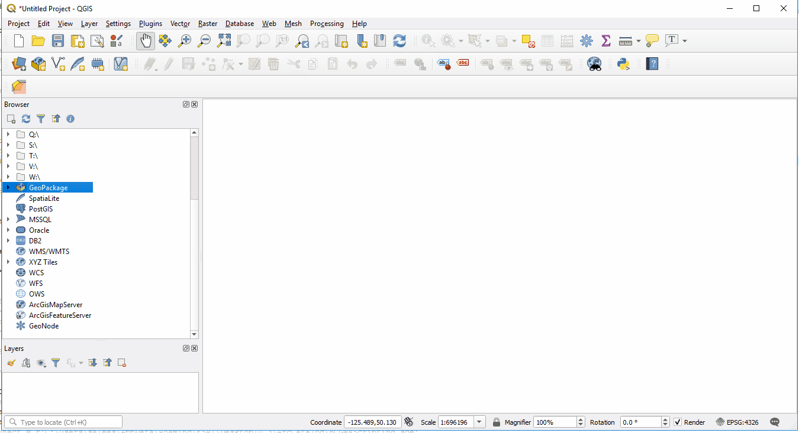
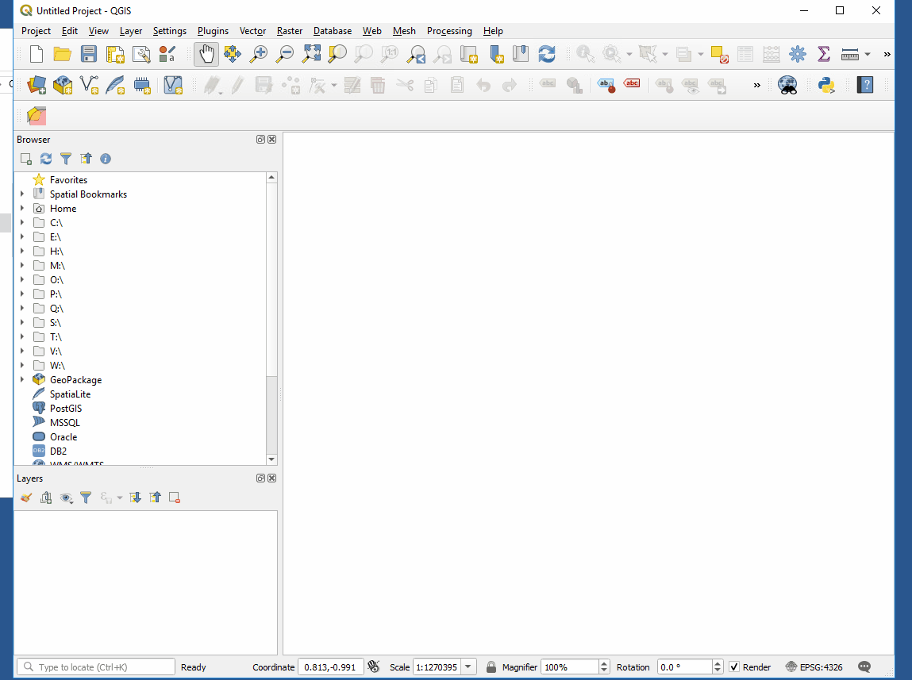
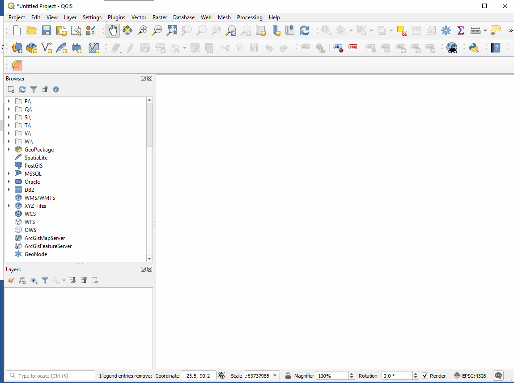
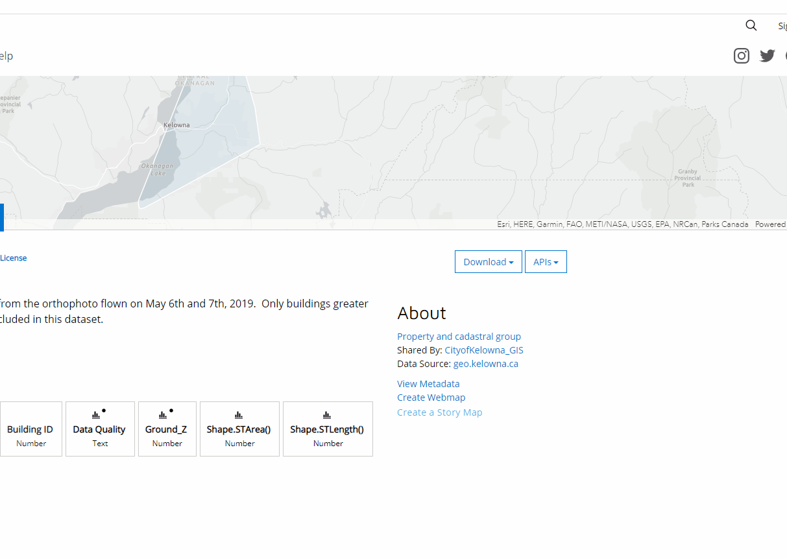
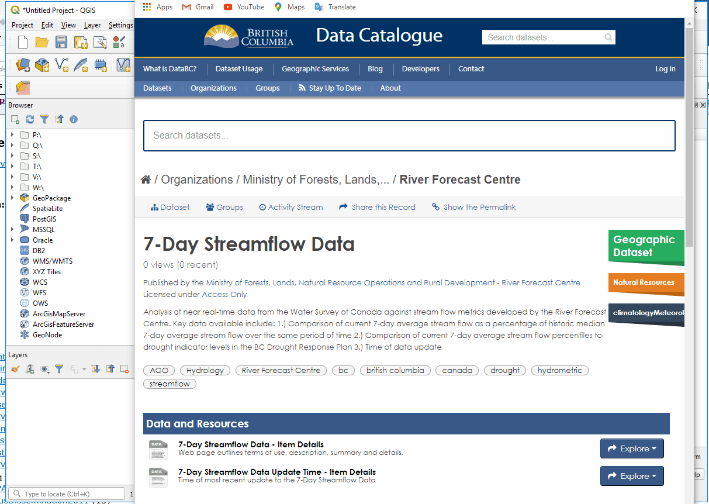
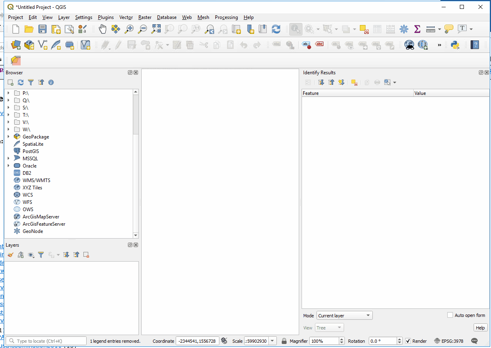

# Web Based data access in QGIS

Within QGIS there are many ways to access data. This sections focus is on accessing data through web mapping services that the BC government and other organizations have available.

## Index
* [Web Mapping in QGIS](#What-is-a-GeodataPackage)
   * [BC Government Web Mapping](#BC-Government-Web-Mapping)
   * [Quick Map Services Plugin](#Quick-Mapservices-Plugin)
* [Web Mapping Service WMS](#Web-Mapping-Service-WMS)
* [Web Coverage Service WCS](#Web-Coverage-Service-WCS)
* [Web Feature Service WFS](#Web-Feature-Service-WFS)
* [ArcGIS Feature Server](#ArcGIS-Feature-Server)
* [ArcGIS Map Server](#ArcGIS-Map-Server)
* [XYZ Tiles](#XYZ-Tiles)
   * [Google](#Google)
   * [Open Street Maps](#Open-Street-Maps)
   * [ESRI](#ESRI)

## Web Mapping in QGIS

In QGIS data can be accessed either through local data sources on your computer or from web based mapping services. QGIS offers a wide range of solutions to access online data minimizing the necessity to download the data to a computer. Web based data sources can be added and managed through the QGIS Browser or Data Source Manager.

- Right click WMS/WMTS in browser window to create a connection or
- Layer-> Data Source manager->WMS to create a new connection

## BC Government Web Mapping

   DataBC offers data connection services that allow users to view thousands of data layers from the B.C. Geographic Warehouse (BCGW) in desktop geospatial software or via web-based map applications.  These connection services deliver current data directly from the BCGW so that you or users of your web mapping applications can work with the latest data available without needing to repeatedly download the data. 

   BC Web mapping services information
   https://www2.gov.bc.ca/gov/content/data/geographic-data-services/web-based-mapping/map-services

   To find WMS data sources in the BC please reference the BC data catalogue. https://catalogue.data.gov.bc.ca/dataset?download_audience=Public

   You are able to tell if a layer is web available by the small labels in the lower right of each feature. It will signify any of the following. WMS, ArcGIS_Rest
     

## Quick Mapservices Plugin

   How to load Plugins in QGOS please refer to. [Loading Plugins](pligins.md)
   
   QGIS has a helpful plugin called Quick Map Services that helps users find webservices through pre-defined links. 

   Install Plugin-> Find QMS on tool bar-> QMS Settings(More services Tab and download/Save)->QMS Button and select service to load.

   Note: This loads the service but does not set it up as a connection in the browser

   

   Additional user contributions of available web services around the world can be found at. https://github.com/nextgis/quickmapservices_contrib

## Web Mapping Service WMS

WMS is the dominant web mapping service used in the BC Government.

The WMS link to use to set up up the BC government mapping service in QGIS is. http://openmaps.gov.bc.ca/geo/ows?

Right Click WMS/WMTS-> New Connection-> Enter the above link in URL and give the connection a name of your choice. The connection will display under WMS in the Browser. Click on arrows to expand out the data tree you just named, then select a feature to drag into layers. Individual layers can also be added as a connection if you are able to find the WMS link in the data catalogue.

 

Many organizations have data available for use through WMS. Some require passwrods while other do not.
(Free and no Passwords)
* BC Government http://openmaps.gov.bc.ca/geo/ows?
* Government of Canada Topographic. https://maps.geogratis.gc.ca/wms/canvec_en?request=getcapabilities&service=wms&version=1.3.0&layers=canvec&legend_format=image/png&feature_info_type=text/html
* Available Government of Canada Open WMS. https://open.canada.ca/data/en/dataset?organization=ec&res_format=WMS

## Web Coverage Service WCS

Another form of online data is a web coverage service. This type of service is very similar to WMS. The difference is that WCS provides access to the raw data which can be queried and used differently than a WMS.

Many examples of WCS can be found at a US government site. NOAA (National Oceanic and Atmoshperic Administration) https://data.noaa.gov/dataset/

NASA also has examples of WCS services that can be added.
https://earthdata.nasa.gov/learn/pathfinders/gis-pathfinder/geospatial-services

The following link will create a large WCS data connection to NASA data. https://webmap.ornl.gov/ogcbroker/wcs?

## Web Feature Service WFS

A web feature service WFS is also similar to a WMS with the difference being that a WFS can provide users the ability to update and edit data if those permissions are given.

The Government of Canada Open Government portal provides good examples of Web Feature Services.
https://open.canada.ca/data/en/dataset?collection=fgp&res_format=WFS

THE USGS United State Geological survey has many examples of WFS layers. https://mrdata.usgs.gov/wfs.html

## ArcGIS Feature Server

Many organizations now have open data policy's that allow for free access to their data through ESRI online servers. The main work is usually finding the service URL at which to make a connection to the server. A feature server returns and displays the GIS shape data of the feature.

Example: Go to city of Kelowna Open Data. Find data required and copy service link. Modify link to reference the whole mapserver and add the data.

https://geo.kelowna.ca/arcgis/rest/services/OpenData/MapServer/

The BC Govenment has been adding more public online features. In the BC Data Catalogue they are referenced as ArcGIS_REST.

Find rest service on data catalogue->Find the URL link to the service->While in the online service look in the lower right for the service URL. Use this link to add the open service to QGIS

## ArcGIS Map Server

An ArcGIS Mapserver is similar to a feature server but performs differently by returning a raster version of the data. The same server links can be used for mapserver or featureserver.

The Natural resource canada NRCAN mapserver can be added.
https://geoappext.nrcan.gc.ca/arcgis/rest/services/BaseMaps

## XYZ Tiles

XYZ tiles are a method to serve up GIS Image data that has been partioned into tiles that only display when the user is at a specific scale and extent. The tiling makes using the data much faster, as it is already made on the delivering server and limits the amount data to be processed on the end users software. QGIS is able to connect to XYS tile servers like Google, Open Street Maps and others.

### Google

      Roadmap: http://mt0.google.com/vt/lyrs=m&hl=en&x={x}&y={y}&z={z} 

      Terrain: http://mt0.google.com/vt/lyrs=p&hl=en&x={x}&y={y}&z={z}

      Altered roadmap: http://mt0.google.com/vt/lyrs=r&hl=en&x={x}&y={y}&z={z}

      Satellite only: http://mt0.google.com/vt/lyrs=s&hl=en&x={x}&y={y}&z={z}

      Terrain only: http://mt0.google.com/vt/lyrs=t&hl=en&x={x}&y={y}&z={z}

      Hybrid: http://mt0.google.com/vt/lyrs=y&hl=en&x={x}&y={y}&z={z}

### Open Street Maps

      Open Map: https://tile.openstreetmap.org/{z}/{x}/{y}.png

### ESRI

      Satellite: https://server.arcgisonline.com/ArcGIS/rest/services/World_Imagery/MapServer/tile/{z}/{y}/{x}

      Relief: https://server.arcgisonline.com/ArcGIS/rest/services/World_Shaded_Relief/MapServer/tile/{z}/{y}/{x}

Browser-Right Click XYS Tiles(New Connection)-> Add Name of Service and the URL.

### License
    Copyright 2019 BC Provincial Government

    Licensed under the Apache License, Version 2.0 (the "License");
    you may not use this file except in compliance with the License.
    You may obtain a copy of the License at

       http://www.apache.org/licenses/LICENSE-2.0

    Unless required by applicable law or agreed to in writing, software
    distributed under the License is distributed on an "AS IS" BASIS,
    WITHOUT WARRANTIES OR CONDITIONS OF ANY KIND, either express or implied.
    See the License for the specific language governing permissions and
    limitations under the License.
